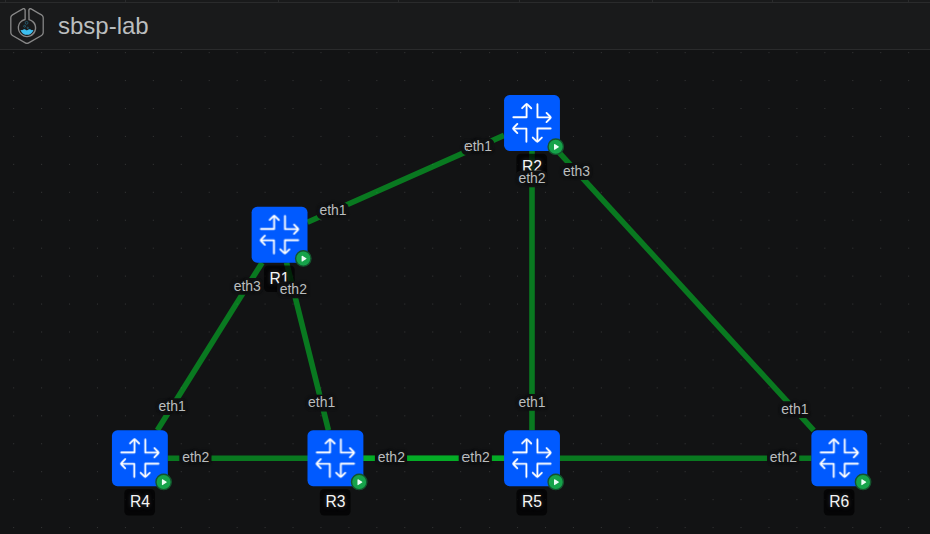

# SBSP — Sorting Barrier Shortest Path Protocol

> ⚠️ **Early-stage research project.** This is an initial proof-of-concept exploring whether a recently published theoretical algorithm can be adapted into a practical routing protocol. It is **not** production-ready and the implementation is incomplete. Contributions, feedback, and criticism are very welcome.

A novel link-state routing protocol that replaces Dijkstra's algorithm (used in OSPF) with the **Sorting Barrier directed SSSP algorithm**, enabling wave-parallel route computation and native asymmetric link cost support.

**Inspired by:** *"Breaking the Sorting Barrier for Directed Single-Source Shortest Paths"* — Ran Duan, Jiayi Mao, Xiao Mao, Xinkai Shu, Longhui Yin. STOC 2025 Best Paper. ([arXiv:2504.17033](https://arxiv.org/abs/2504.17033))

**Built with:** Python 3.12 · asyncio · pyroute2 · ContainerLab · Docker · AI-assisted development

---

## What is SBSP?

SBSP is an experimental link-state routing protocol designed for directed networks. It works similarly to OSPF — routers discover neighbours, exchange link-state advertisements, and compute shortest paths — but replaces Dijkstra's sequential priority queue with a wave-parallel barrier algorithm.

The core idea: instead of popping one node at a time from a min-heap, SBSP groups nodes by topological rank into *waves* and processes all nodes in the same wave simultaneously. This maps naturally to multi-core router ASICs.

### Key differences from OSPF

| Feature            | OSPF                        | SBSP                             |
|--------------------|-----------------------------|----------------------------------|
| Algorithm          | Dijkstra (sequential heap)  | Sorting Barrier (wave-parallel)  |
| Graph type         | Undirected (symmetric)      | Directed (asymmetric native)     |
| Parallelism        | None                        | Per-wave, multi-core             |
| Asymmetric costs   | Not supported               | Native fwd_cost / rev_cost       |
| SCC handling       | Implicit                    | Explicit (Tarjan + Bellman-Ford) |
| Subnet adverts     | Type 3/5 LSA                | Prefix-LSA (type 0x09)           |
| FIB update         | Incremental                 | Atomic diff-push                 |

---

## Project structure

```
sbsp/
├── algo/
│   └── barrier_sssp.py     # Sorting Barrier SSSP + Tarjan SCC detection
├── daemon/
│   ├── hello.py            # Neighbour discovery (asyncio UDP multicast)
│   ├── lsdb.py             # Link-State DB, SBL-LSA encode/decode, flooding
│   ├── advertise.py        # Prefix-LSA: subnet advertisement and flooding
│   ├── compute.py          # Compute engine: SSSP trigger + FIB push
│   └── main.py             # Daemon entry point
├── cli/
│   └── show.py             # Runtime inspection CLI
└── tests/
    └── test_sbsp.py        # Unit + integration tests
Dockerfile                  # Alpine + Python 3.12 + pyroute2
docker-entrypoint.sh        # Interface configuration at container startup
topology.yml                # ContainerLab 6-router spine-leaf topology
pyproject.toml              # Python package definition
```

---

## Prerequisites

- Docker 24+
- [ContainerLab](https://containerlab.dev/install/) 0.75+
- Linux host (Ubuntu 22.04+ recommended)
- Python 3.10+ (for running tests locally)

```bash
# Install ContainerLab
bash -c "$(curl -sL https://get.containerlab.dev)"
```

---

## Quick start

### 1. Run unit tests locally (no Docker needed)

```bash
pip install pytest pytest-asyncio pyroute2
pytest sbsp/tests/ -v
```

### 2. Build the Docker image

```bash
docker build --no-cache -t sbsp:latest .
```

### 3. Deploy the lab

```bash
sudo clab deploy --topo topology.yml
```

### 4. Verify the protocol is running

```bash
# All 6 nodes should show "running"
sudo clab inspect --topo topology.yml

# Check SBSP log — look for "Adjacency FULL" and "Compute done"
sudo docker logs clab-sbsp-lab-R1

# Check routes installed by SBSP
sudo docker exec clab-sbsp-lab-R1 ip route show

# Check subnet routes (192.168.X.0/24) are reachable
sudo docker exec clab-sbsp-lab-R1 ip route show | grep 192.168
sudo docker exec clab-sbsp-lab-R1 ping -c3 192.168.4.1
```

### 5. Simulate a link failure and watch reconvergence

```bash
# Bring down R1 <-> R4 link
sudo docker exec clab-sbsp-lab-R1 ip link set eth3 down

# Watch R1 reconverge in the logs
sudo docker logs -f clab-sbsp-lab-R1 | grep -E "DOWN|Compute|epoch"

# Restore
sudo docker exec clab-sbsp-lab-R1 ip link set eth3 up
```

### 6. Prove the wave computation

```bash
sudo docker exec clab-sbsp-lab-R1 python3 -c "
import sys; sys.path.insert(0,'/app')
from sbsp.algo.barrier_sssp import sorting_barrier_sssp, reconstruct_path
from collections import defaultdict

edges = [
  ('R1','R2',10), ('R1','R3',10), ('R1','R4',10),
  ('R2','R5',10), ('R2','R6',10),
  ('R3','R5',10), ('R4','R6',10),
]
dist, prev = sorting_barrier_sssp(edges, 'R1')

print('=== Shortest paths from R1 ===')
for dst in sorted(dist):
    if dst == 'R1': continue
    path = reconstruct_path(prev, dst)
    print(f'  to {dst}: cost={dist[dst]:.0f}  path: {\" -> \".join(path)}')

waves = defaultdict(list)
for node, d in dist.items():
    waves[int(d/10)].append(node)
print()
print('=== Barrier waves ===')
for w in sorted(waves):
    print(f'  Wave {w}: {sorted(waves[w])}  <- processed in parallel')
"
```

### 7. Tear down

```bash
sudo clab destroy --topo topology.yml --cleanup
```

---

## Topology

```
     192.168.1.0/24          192.168.2.0/24
          |                       |
     R1 (spine) ─────────── R2 (spine)
    / │ \                   / │ \
  R3  R4  \               R5  R6  \
  │    └────────────────────────────┘
192.168.3/4/5/6.0/24 on each leaf router's loopback
```




Each router owns a `192.168.X.0/24` subnet on a loopback interface (`lo1`). These are advertised via Prefix-LSAs and installed as routes on all other routers by the SBSP compute engine.

---

## Algorithm overview

```
1. Tarjan SCC detection        O(V + E)
2. DAG condensation            SCCs → super-nodes
3. Kahn topological sort       assigns wave rank per super-node
4. Wave relaxation:
     for each wave (in rank order):
         parallel-for each node in wave:
             relax all outgoing edges
         ── BARRIER ── all threads sync here
5. Bellman-Ford within SCCs    bounded by SCC diameter
6. FIB diff-push               only changed routes updated
```

Complexity: O(m log²/³ n) per computation (from the Duan et al. paper), versus O((m + n) log n) for Dijkstra.

---

## Research paper credit

This project is an applied engineering exploration of the theoretical result in:

> **"Breaking the Sorting Barrier for Directed Single-Source Shortest Paths"**
> Ran Duan, Jiayi Mao, Xiao Mao, Xinkai Shu, Longhui Yin
> *57th Annual ACM Symposium on Theory of Computing (STOC 2025)* — **Best Paper Award**
> arXiv: https://arxiv.org/abs/2504.17033
> ACM DL: https://dl.acm.org/doi/10.1145/3717823.3718179

The SBSP protocol design, daemon implementation, and ContainerLab integration are original work built on top of the theoretical foundation in that paper.

---

## Current status and known limitations

- **Hello protocol**: working — neighbour discovery via UDP multicast
- **LSA flooding**: partial — origination and aging work; full DBD/LSR/LSU exchange not yet implemented (routers skip straight to FULL state)
- **SSSP computation**: working — Sorting Barrier + Tarjan SCC + Bellman-Ford fallback
- **FIB push**: working — pyroute2 Netlink writes for both transit and prefix routes
- **Subnet advertisement**: working — Prefix-LSA originated and installed
- **Parallelism**: not yet — wave processing is single-threaded Python; `multiprocessing.Pool` planned
- **Multi-area**: not yet — single area 0.0.0.0 only
- **BarrierSync receiver**: not yet — epoch packets sent but not acted on by peers

---

## Roadmap

- [x] Phase 1 — Core algorithm (Sorting Barrier SSSP + Tarjan SCC)
- [x] Phase 2 — Protocol daemon (Hello, LSDB, compute engine)
- [x] Phase 3 — ContainerLab 6-router topology
- [x] Phase 4 — Subnet advertisement (Prefix-LSA)
- [x] Phase 5 — Unit and integration tests
- [ ] Phase 6 — Full LSDB exchange (DBD/LSR/LSU/LSAck)
- [ ] Phase 7 — BarrierSync receiver + epoch coordination
- [ ] Phase 8 — Parallel wave computation (multiprocessing.Pool)
- [ ] Phase 9 — Multi-area support (ABR summarization)
- [ ] Phase 10 — Benchmarking vs FRRouting OSPF
- [ ] Phase 11 — RFC-style specification document

---

## Contributing

Contributions are very welcome — this is an early-stage research project and there is a lot of ground to cover. See [CONTRIBUTING.md](CONTRIBUTING.md) for how to get started.

Good first issues are labelled `good-first-issue` in the issue tracker. Areas most in need of help: full LSDB exchange (Phase 6), parallel wave computation (Phase 8), and test coverage expansion.

---

## License

MIT — see [LICENSE](LICENSE).